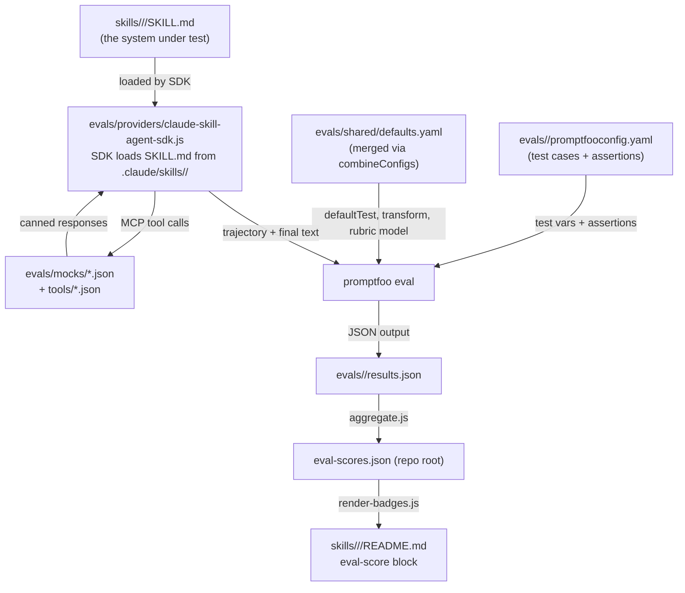
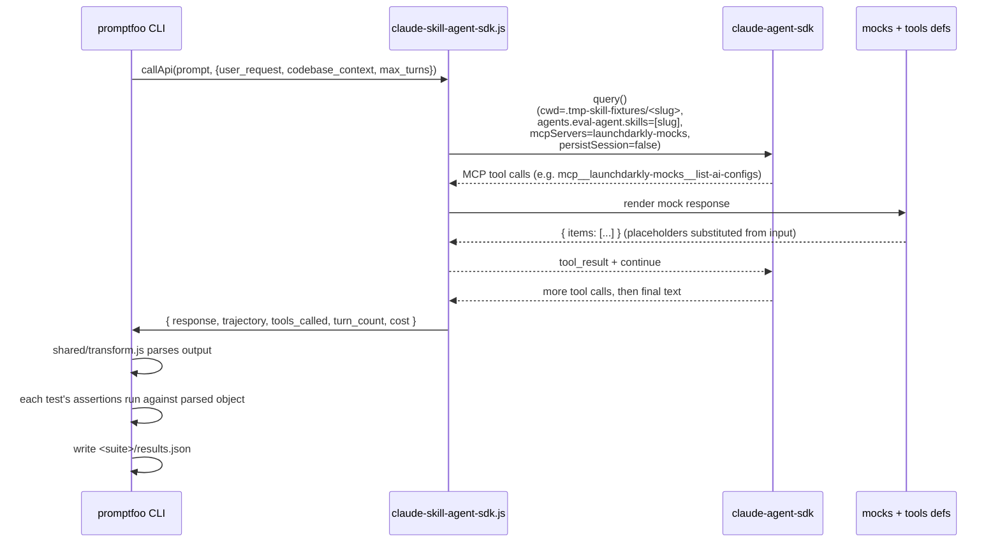
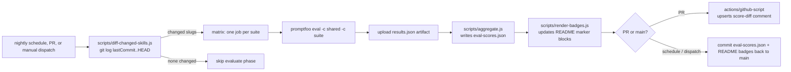

# Skill Eval System

How we evaluate the public skills under `skills/` so they keep working as
the SKILL.md files, mocks, and provider evolve, and so the score is
visible to anyone considering installing one.

> Looking for "how do I run this" or "how do I add a new suite"? That lives
> in [evals/README.md](../evals/README.md). This doc explains *what* the
> system does, *why* it's shaped this way, and how the pieces fit together.

## What it is, in one paragraph

Every public skill gets a small set of test cases. A test case is a user
request and (optionally) a fake "codebase context" string. A provider
puts Claude in front of mocked LaunchDarkly tools, drives the agent
through the skill's workflow, and emits a structured record of what
happened: every tool call with its arguments, the final response text,
and turn/cost telemetry. Then we make deterministic and rubric-graded
assertions against that record - did it call the right tools in the
right order, did the arguments look reasonable, did the final response
cover the things the skill says to cover. Scores are aggregated into
one machine-readable file at the repo root and surfaced as README
badges so a user installing a skill sees its current quality before
they trust it.

## Why this shape

A few constraints drove the design:

1. **Skills are prompts, not code.** The "thing under test" is a markdown
  file. We can't unit-test a markdown file - we can only observe what an
    agent does with it. So the SUT is "Claude + this SKILL.md + these
    tools," and assertions watch the trajectory.
2. **Real tools are slow, expensive, and stateful.** Hitting the real
  LaunchDarkly API for every test case would be flaky (rate limits,
    project state drift), expensive (more API calls than just the model),
    and would muddy what we're measuring. Mocked tools let us pin behaviour
    to a deterministic surface and only spend tokens on the model.
3. **Skills get loaded the way real users load them.** The provider runs
  the Claude Agent SDK and lets the SDK discover SKILL.md from
    `.claude/skills/<slug>/`, exactly like a real Claude Code session.
    Packing SKILL.md into a `system` slot would measure the prose in a
    clean room but bypass the loader path users actually hit, so we
    don't.
4. **We don't want a quality theatre.** It's easy to write tests that
  always pass - generic "does the response mention the skill's name?"
    rubrics, or assertions on behaviours the skill doesn't actually
    promise. The assertions in each suite are derived directly from the
    workflow steps in the corresponding SKILL.md, so a regression in the
    skill text actually moves the score.

**CI cost has to be reasonable.** Re-evaluating every skill on every PR can be costly. Diff-gated CI re-runs only the suites whose source  
  actually moved since their last recorded score.

## Architecture at a glance




Three players matter most: **the provider** is the agent loop (the  
Claude Agent SDK driving Claude through tools, the runner intercepting  
and mocking each one); **the suite config** is the set of test cases  
plus assertions; and **the shared defaults** wire the rubric grader,  
output parser, and per-suite cost/latency budgets in one place.

## How the provider drives a run

`evals/providers/claude-skill-agent-sdk.js` is the bridge between
promptfoo's per-test loop and a running agent. For each suite:

- It builds a per-skill isolated cwd at
`evals/.tmp-skill-fixtures/<slug>/` containing only a symlink at
`.claude/skills/<slug>/` back to the real skill source. The SDK's
project-scoped skill discovery sees only that one skill, not every
sibling in the repo.
- It also redirects `CLAUDE_CONFIG_DIR` to an empty throwaway
directory so machine-level "policy/managed" skills installed at
`~/Library/Application Support/ClaudeCode/.claude/skills/` (and the
equivalents on other platforms) can't leak in.
- It calls `query()` from `@anthropic-ai/claude-agent-sdk` with
`cwd: <fixture>`, `settingSources: ['project']`, and `tools: []` so
Claude Code's built-in tools are turned off and the only callable
tools are the mocked LaunchDarkly MCP tools we register through
`createSdkMcpServer(...)`.
- The agent definition (`agents['eval-agent']`) declares
`skills: [<slug>]` to force-preload the skill body and a tight
`agent.prompt` that mandates following the skill's workflow,
including verification steps.
- Mocked tool responses come from `mocks/tool-responses.json` with
template placeholders substituted from the tool input. Every call
is recorded into a `trajectory` array.
- When the agent finishes, the provider returns
`{ response, trajectory, tools_called, turn_count, cost }` so suite
assertions can read `output.trajectory` directly.

Claude Code's CLI also bundles a fixed set of internal-only "built-in"
skills into `cli.js` (`update-config`, `debug`, `simplify`, `batch`,
`loop`, `schedule`, `claude-api`). They appear in every `init.skills`
list regardless of `cwd` or `CLAUDE_CONFIG_DIR`. Suppressing them
would require forking the SDK; they don't activate on AI-Config
prompts so they don't influence behaviour, they just consume some
baseline context tokens that real Claude Code sessions also pay.

## Anatomy of a test case

A single test case in a suite config looks like this (slightly trimmed):

```yaml
- description: "Lists existing AI Configs before creating a new one"
  vars:
    user_request: >
      Create an AI Config in agent mode for a customer-support chatbot.
      Project key is "support-bot". Use GPT-4o.
    codebase_context: >
      The codebase uses the LaunchDarkly Node.js server SDK. AI Config
      keys are kebab-case.
  assert:
    - type: javascript
      value: |
        const tools = output.tools_called || [];
        const listIdx = tools.indexOf('list-ai-configs');
        const createIdx = tools.lastIndexOf('create-ai-config');
        const pass = listIdx >= 0 && createIdx > listIdx;
        return { pass, score: pass ? 1 : 0, reason: 'list@' + listIdx + ' create@' + createIdx };
      metric: explores_before_creating
      weight: 3

    - type: llm-rubric
      value: |
        The agent was asked to create an agent-mode AI Config. Evaluate:
        1. Did it list existing configs first?
        2. Did it pick the correct mode (agent, not completion)?
        3. Did it follow the skill's two-step creation workflow?
      metric: workflow_quality
      weight: 2
```

Each test case mixes **deterministic** assertions (cheap, fast, no model
calls, used wherever there's a clear right answer) with **rubric**
assertions (one extra model call per assertion, used for "did it follow
the workflow correctly" judgements that don't reduce to a single boolean).

## Lifecycle of one run




A few specifics worth knowing:

- `**max_turns**` is clamped to `1..30` (default 15). Tests that
expect a short trajectory can override this in test vars to surface
"took too long" as a clearer failure mode.
- `**cost**` flows through from the SDK's `result` message. The
provider aggregates `modelUsage` (input + output + cache reads +
cache creations) across every turn so multi-turn runs don't
under-report. promptfoo's `cost` assertion in
`shared/defaults.yaml` works without a real provider integration.
- **Mock substitution walks the parsed object** instead of operating on
the JSON-stringified form. That means a tool input containing
`Has "quote"` no longer breaks the JSON parse path - we substitute
placeholders only inside string leaves.
- `**persistSession: false`.** Promptfoo runs tests with concurrency
  > 1 by default; two parallel queries sharing the same per-skill cwd
  > would otherwise both try to write to
  > `<cwd>/.claude/projects/.../session.jsonl` and deadlock. We also
  > don't need session resumption for single-shot evals.

## Two models, two different jobs

Two distinct env vars drive the run, and they intentionally point at
different models:


| Variable       | Used by                                        | Default                                        | Why                                                                                                |
| -------------- | ---------------------------------------------- | ---------------------------------------------- | -------------------------------------------------------------------------------------------------- |
| `AGENT_MODEL`  | the provider (system under test)               | `claude-sonnet-4-20250514`                     | Stays on Claude because that's representative of what users actually run when they install a skill |
| `RUBRIC_MODEL` | `defaultTest.options.provider` (rubric grader) | `anthropic:messages:claude-haiku-4-5-20251001` | Cheaper grader. Saves roughly 10x on grading cost without changing what we measure                 |


Splitting them solves two problems at once: cost (rubric calls dominate
because every `llm-rubric` assertion is one model call), and the
self-grading bias of using the same model as both author and judge.

## Shared defaults: the "every suite gets these" layer

`evals/shared/defaults.yaml` is loaded as a second `-c` flag whenever a
suite runs. promptfoo's `combineConfigs` deep-merges `defaultTest.options`,
concatenates `defaultTest.assert`, and dedupes providers, so each suite
config only declares what's specific to it.

The shared defaults supply three things:

1. `**options.provider`** - the rubric grader, always the cheap model.
2. `**options.transform**` - parses the provider's JSON output once so
  every downstream assertion gets `output` already as an object. Before
    this existed, every assertion started with `const r = JSON.parse(output);`
    (~60 redundant calls across the suites).
3. `**assert: [output_valid, cost, latency]**` - cheap regression catches.
  `output_valid` is `weight: 0` so it doesn't move the score - it just
    surfaces "the transform failed to parse" with a clear reason instead
    of letting a stack trace hide the underlying problem.

## Trajectory ordering convention

Most assertions check things like "did the agent call `create-ai-config`
*after* `list-ai-configs`?" The convention is:

- **FIRST occurrence** of the prerequisite (`tools.indexOf('list-ai-configs')`)
- **LAST  occurrence** of the verifier   (`tools.lastIndexOf('create-ai-config')`)

The reason this matters: agents commonly do `get-foo`, mutate, then
`get-foo` again to verify. With `indexOf` for both, the
"post-mutation get" assertion silently passes against the *pre*-mutation
call. `lastIndexOf` for the verifier closes that hole. The convention is
applied consistently across every suite.

`evals/shared/assertions.js` exports helpers (`firstCallOf`, `lastCallOf`,
`expectAfter`, etc.) for use in scripts and file://-loaded assertions.
Inline `type: javascript` assertions in promptfoo cannot `require` modules

- they run in a `new Function("output", "context", "process", body)`
context - so inline assertions implement the convention by hand. The
shared helpers serve as the single reference.

## CI flow: diff-gated, score-aware




The diff script reads `eval-scores.json`, looks at each entry's
`lastCommit`, and asks `git log lastCommit..HEAD -- <narrow paths>`
whether anything in that suite's source has changed. The narrow paths are:

- `skills/<area>/<slug>/SKILL.md`
- `skills/<area>/<slug>/references/**`
- `skills/<area>/<slug>/marketplace.json`
- `evals/<suite>/**`

There's also a "global triggers" set - changes to
`evals/{providers,shared,tools,mocks}` flag every suite, since those
files are infrastructure shared by all of them. Most PRs touch a single
skill, so most CI runs evaluate exactly one suite.

The artifact at the centre of all this is `**eval-scores.json**` at the
repo root. Its schema is intentionally minimal:

```json
{
  "schemaVersion": 1,
  "updatedAt": "2026-04-29T00:26:31.436Z",
  "skills": {
    "ai-configs/aiconfig-create": {
      "score": 100,
      "passed": 5,
      "total": 5,
      "status": "passing",
      "lastCommit": "f6ba95f",
      "lastRun": "2026-04-29T00:17:51.803Z",
      "perTest": [
        { "description": "Creates an agent-mode AI Config...", "pass": true, "score": 1.0 }
      ]
    }
  }
}
```

`scripts/render-badges.js` reads this and rewrites only the contents
between `<!-- eval-score:start -->` and `<!-- eval-score:end -->` in each
skill's README. Manual edits outside that block are preserved exactly, so
README authors can move the badge anywhere they want and it stays put.

## File map

```
agent-skills/
├── eval-scores.json              # the public quality artifact (committed, refreshed by CI)
├── .github/workflows/eval-skills.yml
├── docs/
│   └── evals.md                  # this file
└── evals/
    ├── README.md                 # how-to: setup, running, adding suites
    ├── package.json              # npm scripts wire everything together
    ├── .env.example              # ANTHROPIC_API_KEY, AGENT_MODEL, RUBRIC_MODEL
    ├── shared/
    │   ├── defaults.yaml         # merged into every suite via -c
    │   ├── transform.js          # parses output once
    │   ├── output-valid.js       # weight-0 sanity assertion
    │   └── assertions.js         # FIRST/LAST helpers + convention reference
    ├── providers/
    │   ├── claude-skill-agent-sdk.js # SDK-based agent loop (.claude/skills/<slug> + mocked LD MCP tools)
    │   ├── _mock.js                  # object-walker mock substitution
    │   └── _jsonschema-to-zod.js     # JSON Schema -> Zod raw shape
    ├── tools/
    │   └── definitions.json          # Anthropic-format LD MCP tool defs
    ├── mocks/
    │   └── tool-responses.json       # canned LD API responses
    ├── scripts/
    │   ├── _manifest.js              # canonical suite -> skill mapping
    │   ├── _smoke-sdk.js             # local smoke runner / SDK init dump
    │   ├── _diag-isolation.js        # local diag for skill-discovery isolation
    │   ├── aggregate.js              # runs suites, emits eval-scores.json
    │   ├── diff-changed-skills.js    # which suites need re-running
    │   └── render-badges.js          # syncs README badges from scores
    ├── .tmp-skill-fixtures/          # generated at runtime by the provider, gitignored;
    │                                 # one isolated cwd per skill slug, containing only
    │                                 # .claude/skills/<slug>/ symlinked back to ../../skills/...
    │                                 # so the SDK only discovers the one skill being evaluated
    └── <suite>/
        └── promptfooconfig.yaml      # description + prompts + provider config + tests
```

## Adding coverage

The cheapest way to add a new suite (verified across the existing AI
Config suites):

1. Identify the SKILL.md you want to cover and skim its workflow steps -
  those become your assertion criteria.
2. Confirm every MCP tool the skill mentions exists in
  `evals/tools/definitions.json` and has a mock in
    `evals/mocks/tool-responses.json`. Add what's missing.
3. Create `evals/<suite>/promptfooconfig.yaml` with 3-5 test cases:
  happy path, variant input, exploration without context, edge case,
    safety scenario. (See `evals/README.md` for the template.)
4. Add the suite to `evals/scripts/_manifest.js` (`suite`, `skillKey`,
  `skillDir`, `readme`).
5. Add `eval:<suite>` and `eval:<suite>:single` scripts to
  `evals/package.json` matching the pattern of the existing ones.
6. Run `npm run eval:<suite>:single` to validate the pipeline, then
  `npm run eval:all` (or `npm run eval:aggregate`) to refresh the
    baseline.

The aggregator + CI pick up the new suite automatically once it's in
`_manifest.js`.

## Open questions and known limitations

- **Coverage gaps.** Several public-facing skills don't yet have eval
suites - notably `flag-create`, `flag-cleanup`, `flag-targeting`,
`aiconfig-projects`, `aiconfig-targeting`, and
`aiconfig-online-evals`. The infrastructure is in place; what's
missing is the suites themselves. Adding them is a separate piece
of work.
- **Trigger-precision evals.** "Did the agent invoke this skill at the
right moment?" is a different problem from "given the skill was
invoked, did it follow the workflow correctly." The current evals
only measure the second. Trigger-precision evaluation is host-specific
(it lives at the agent platform layer, not the skill layer) and is
out of scope for this system.
- **Soft failures.** `eval-scores.json` is informational while the
baseline stabilises - failing assertions on a PR are a comment, not
a required check. Promoting the score to a required check is a
one-line config change once we trust the floor.
- **Self-grading bias.** Even with a separate rubric model, both are
Anthropic-family by default. A truly independent grader (e.g.,
`openai:gpt-5-mini` for `RUBRIC_MODEL`) would catch failures the
Anthropic family agrees on. Switching is a one-line `.env` change.
- `**prompts: []` and `providers: []` in `shared/defaults.yaml`.** These
placeholders silence promptfoo's per-config "must have providers OR
targets" validator. They're empty so they don't accidentally append
to a suite's real providers/prompts via concat. If a future
promptfoo version changes that validator, we can drop the
placeholders.

## Pointers

- How-to (setup, running, adding suites): [evals/README.md](../evals/README.md)
- Suite configs:        `evals/<suite>/promptfooconfig.yaml`
- Shared defaults:      `evals/shared/defaults.yaml`
- Aggregated scores:    [eval-scores.json](../eval-scores.json)
- CI workflow:          [.github/workflows/eval-skills.yml](../.github/workflows/eval-skills.yml)

